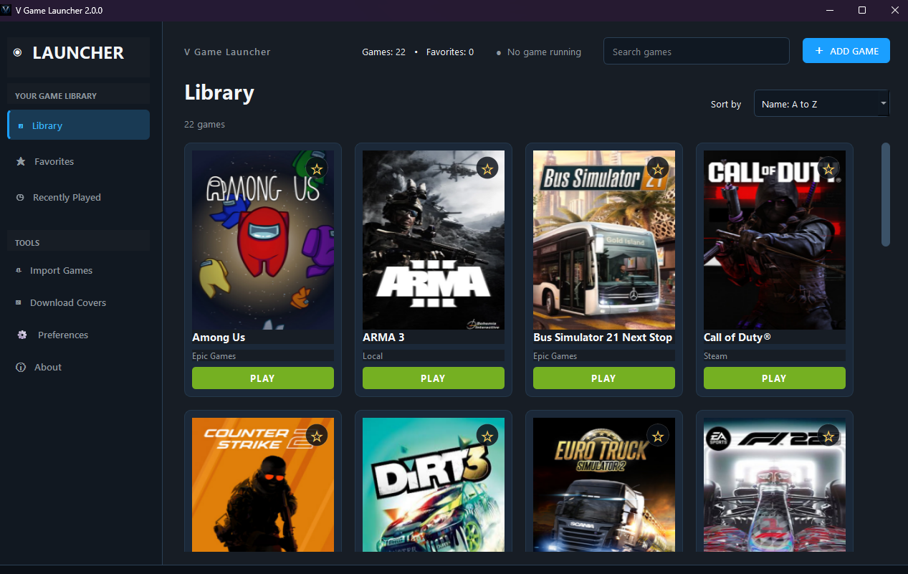
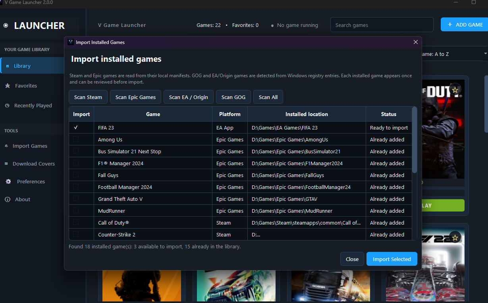
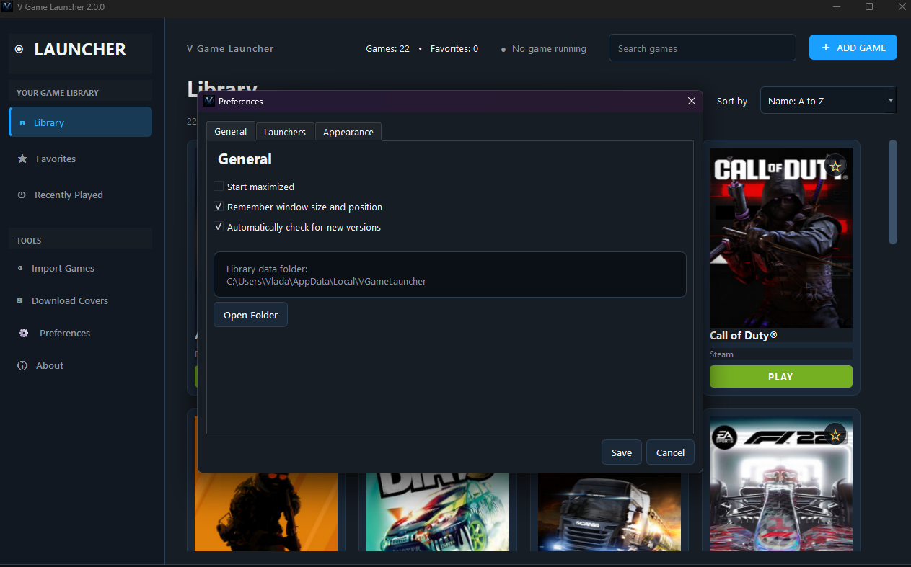
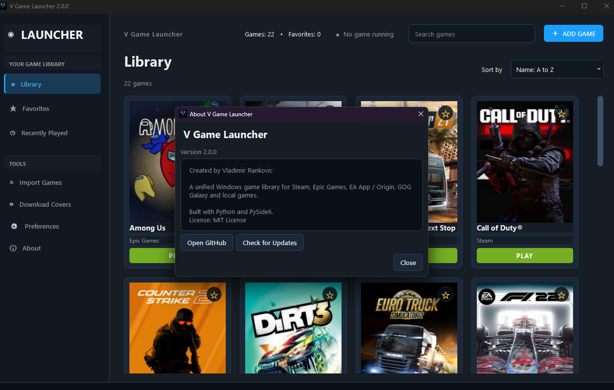

# V Game Launcher

A modern Windows desktop game launcher built with Python and PySide6.

V Game Launcher lets you manage and launch games from one place, including local games and supported launcher-based libraries such as Steam, Epic Games, EA App / Origin, and GOG.



---

## Features

- Import installed Steam games
- Import installed Epic Games titles
- Detect supported EA App / Origin games
- Detect supported GOG games
- Add local games manually
- Download and manage cover images
- Favorites support
- Recently Played section
- Search and sorting options
- Dark and Light theme support
- Automatic check for newer versions
- Direct link to GitHub Releases for updates

---

## Screenshots

### Library


### Import Installed Games



### Preferences



### About



---

## Download

Download the latest Windows executable from the repository's **Releases** section:

[Latest Release](https://github.com/vladimirrankovicqa/V-Game-Launcher/releases/latest)

---

## Running From Source

```powershell
python -m pip install -r requirements.txt
python v_game_launcher.py